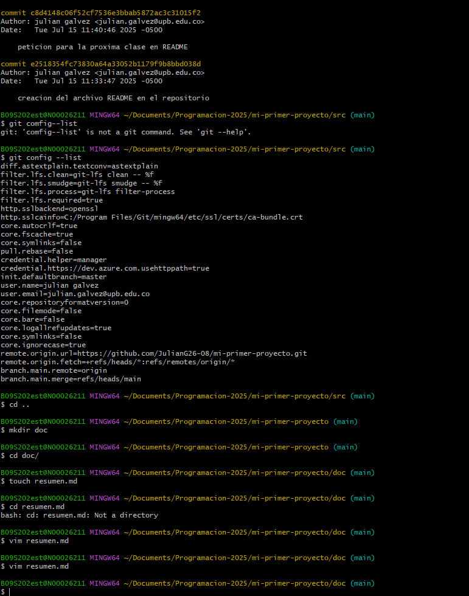

# Como crear un repositorio de github
Lo primero es crear una carpeta usando elcomando "mkdir" luego éntramos a esa carpeta con el comando (Cd "nombre de la carpeta") y usamos el comando "git init" Para convertir la carpeta en un repositorio de git 
# Como enlazar con el repositorio local
Ahora vamos a crear un archivo editable con el comando (touch "nombre del archivo.md") y ahora usamos el comando (git add "nombre del archivo") para agregar el archivo al repositorio local 
# Como se sincroniza con la nube
Ahora que ya tenemos nuestro repositorio con un archivo lo podemos sincronizar con la nube usando el comando "git push" y con eso ya tendremos nuestra carpeta con todos sus datos subidos a la nube de Github

